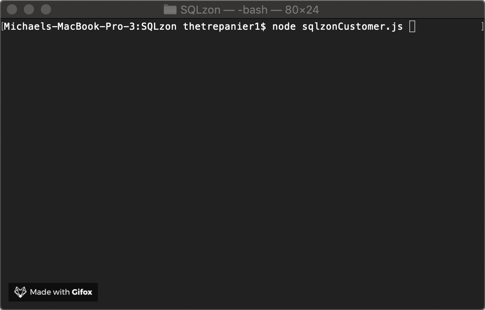

# SQLzon

## The best `localhosted` store on your computer!

SQLzon located at `127.0.0.1` is a node.js CLI app that will interact with a MySQL database.

On launch, the user is presented with all items available for purchase. When prompted by SQLzon, the user will enter the id of the product that they would like to purchase. If the id given by the user is listed in the database, then the cost of the order will be calculated and the quantity purchased will be deducted from the amount in our SQLzon wearhouse.

## FAQ

Q: How do I know if I'm going to like what I purchase from your store?

A: All products purchased from SQLzon have a 100% customer satisfaction guarantee. 

Q: When can I expect my package to arive?

A: Wait we actually have to ship these things... Hang on... OK, so we ship all orders within 7 -- 8 business years.